# Architecture

This document describes the internal architecture of dhcplease, a DHCP server implementation in Rust.

## Overview

dhcplease is structured as a single-threaded async server using Tokio. It listens on UDP port 67, parses incoming DHCP packets, processes them according to RFC 2131/2132, and sends appropriate responses. The server maintains lease state in memory with periodic persistence to a JSON file.

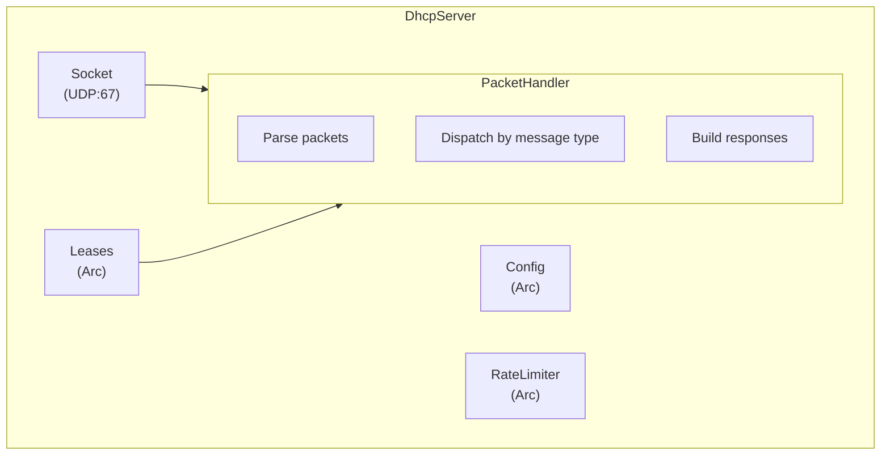

## Module Structure

```
src/
├── main.rs      # CLI entry point, argument parsing
├── lib.rs       # Public API exports
├── server.rs    # DHCP server and packet handling
├── config.rs    # Configuration loading and validation
├── lease.rs     # Lease management and persistence
├── packet.rs    # DHCP packet parsing and encoding
├── options.rs   # DHCP option parsing and encoding
└── error.rs     # Error types
```

### Module Responsibilities

| Module | Responsibility |
|--------|----------------|
| `server` | Main event loop, packet dispatch, response building |
| `config` | Load/save JSON config, validation, static bindings |
| `lease` | IP allocation, lease CRUD, persistence, thread safety |
| `packet` | Parse/encode 236-byte DHCP header + options |
| `options` | Parse/encode individual DHCP options (TLV format) |
| `error` | `Error` enum and `Result` type alias |

## Packet Flow

### Receive Path

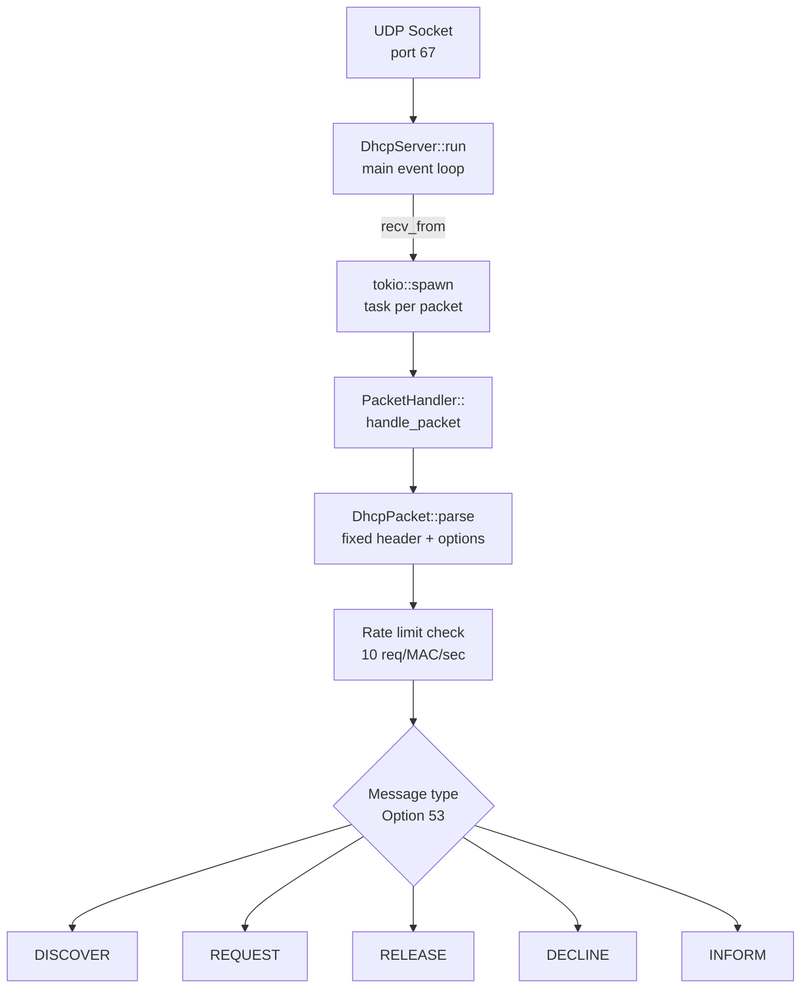

### DORA Flow

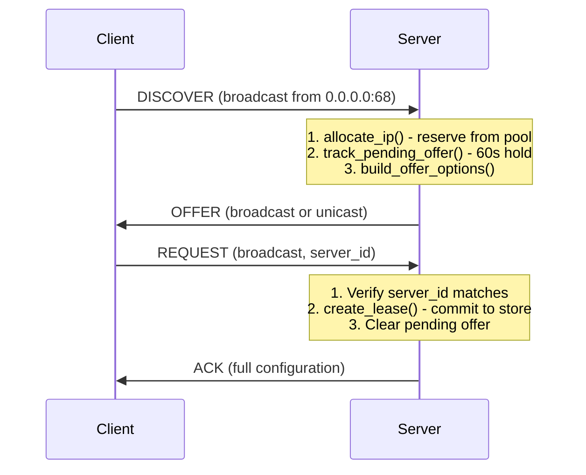

### Response Destination Logic

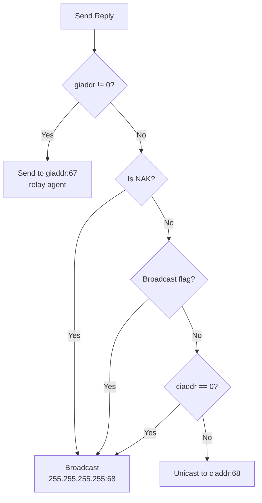

## Data Structures

### DhcpPacket

Represents the wire format of a DHCP message (RFC 2131 §2):

```
 0                   1                   2                   3
 0 1 2 3 4 5 6 7 8 9 0 1 2 3 4 5 6 7 8 9 0 1 2 3 4 5 6 7 8 9 0 1
+-+-+-+-+-+-+-+-+-+-+-+-+-+-+-+-+-+-+-+-+-+-+-+-+-+-+-+-+-+-+-+-+
|     op (1)    |   htype (1)   |   hlen (1)    |   hops (1)    |
+---------------+---------------+---------------+---------------+
|                            xid (4)                            |
+-------------------------------+-------------------------------+
|           secs (2)            |           flags (2)           |
+-------------------------------+-------------------------------+
|                          ciaddr (4)                           |
+---------------------------------------------------------------+
|                          yiaddr (4)                           |
+---------------------------------------------------------------+
|                          siaddr (4)                           |
+---------------------------------------------------------------+
|                          giaddr (4)                           |
+---------------------------------------------------------------+
|                          chaddr (16)                          |
+---------------------------------------------------------------+
|                          sname (64)                           |
+---------------------------------------------------------------+
|                          file (128)                           |
+---------------------------------------------------------------+
|                    magic cookie (4) = 99.130.83.99            |
+---------------------------------------------------------------+
|                          options (variable)                   |
+---------------------------------------------------------------+
```

Key fields:
- `op`: 1 = BOOTREQUEST (client), 2 = BOOTREPLY (server)
- `xid`: Transaction ID, echoed in replies
- `ciaddr`: Client's current IP (used in RENEWING/REBINDING)
- `yiaddr`: "Your" IP - the address being assigned
- `giaddr`: Relay agent IP (non-zero if relayed)
- `chaddr`: Client hardware address (MAC)
- `flags`: Bit 15 = broadcast flag

### DhcpOption

Options use TLV (Type-Length-Value) encoding:

```
+--------+--------+--------+--------+
|  Code  | Length |       Data      |
+--------+--------+--------+--------+
   1 byte  1 byte   Length bytes
```

Special cases:
- Code 0 (Pad): No length/data, used for alignment
- Code 255 (End): No length/data, terminates options

Implemented options:

| Code | Name | Purpose |
|------|------|---------|
| 1 | Subnet Mask | Network mask for client |
| 3 | Router | Default gateway(s) |
| 6 | DNS Server | DNS server address(es) |
| 12 | Hostname | Client's hostname |
| 15 | Domain Name | DNS domain suffix |
| 26 | Interface MTU | Maximum transmission unit |
| 28 | Broadcast Address | Subnet broadcast address |
| 50 | Requested IP | Client's preferred IP |
| 51 | Lease Time | Lease duration in seconds |
| 52 | Option Overload | sname/file contain options |
| 53 | Message Type | DISCOVER/OFFER/REQUEST/ACK/NAK/RELEASE/DECLINE/INFORM |
| 54 | Server Identifier | DHCP server's IP |
| 55 | Parameter Request List | Options client wants |
| 58 | Renewal Time (T1) | When to start unicast renewal |
| 59 | Rebinding Time (T2) | When to start broadcast renewal |
| 61 | Client Identifier | Unique client ID (overrides chaddr) |
| 82 | Relay Agent Info | Added by relay, must be echoed |

### Lease

```rust
struct Lease {
    ip_address: Ipv4Addr,      // Assigned IP
    client_id: String,          // Hex-encoded client identifier
    hostname: Option<String>,   // From Option 12
    expires_at: DateTime<Utc>,  // When lease expires
    created_at: DateTime<Utc>,  // Original creation time
    last_seen: DateTime<Utc>,   // Last renewal/activity
}
```

### LeaseStore (Persisted State)

```rust
struct LeaseStore {
    leases: HashMap<String, Lease>,           // client_id → Lease
    ip_to_client: HashMap<Ipv4Addr, String>,  // Reverse lookup
    declined_ips: HashMap<Ipv4Addr, DateTime<Utc>>,  // Conflict tracking
}
```

### InternalState (Runtime State)

```rust
struct InternalState {
    store: LeaseStore,                              // Persisted data
    free_ips: BTreeSet<Ipv4Addr>,                   // Available pool IPs
    pending_offers: HashMap<String, PendingOffer>,  // Pre-lease reservations
    pending_ips: HashSet<Ipv4Addr>,                 // IPs in pending offers
    dirty: bool,                                    // Needs persistence
    last_save: Instant,                             // Rate limit saves
}
```

## Thread Safety Model

The server uses a "spawn per packet" model with shared state protected by async locks:

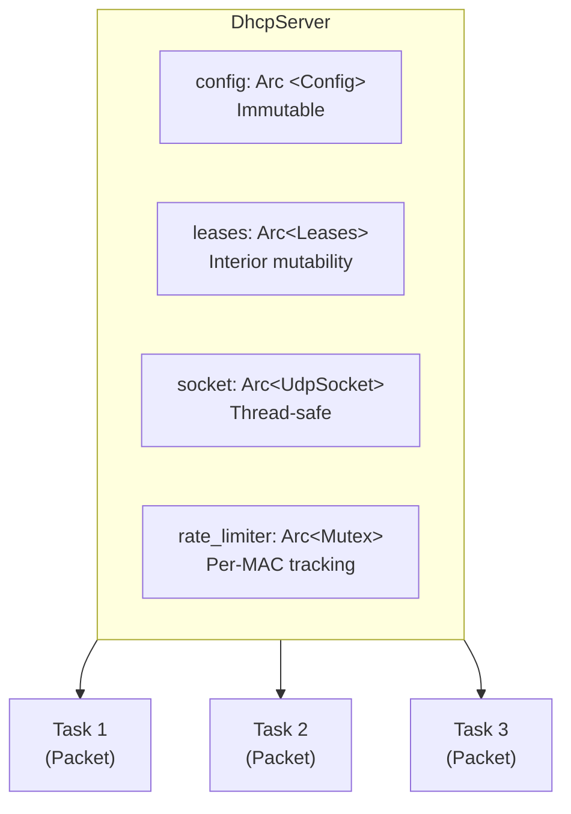

### Lock Strategy

| Resource | Lock Type | Reason |
|----------|-----------|--------|
| `InternalState` | `RwLock` | Allows concurrent reads (get_lease, list_leases) |
| `rate_limiter` | `Mutex` | Simple map, no read-heavy workload |
| `save_lock` | `Mutex` | Prevents concurrent file writes |

### Lock Ordering

To prevent deadlocks, locks are always acquired in this order:
1. `state` (RwLock)
2. `save_lock` (Mutex) - only held during file I/O

The `rate_limiter` is independent and never held while acquiring other locks.

## IP Allocation Algorithm

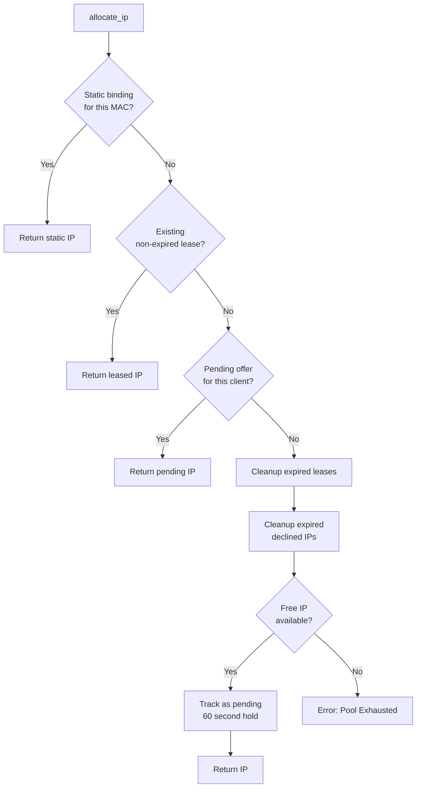

### Pending Offer Lifecycle

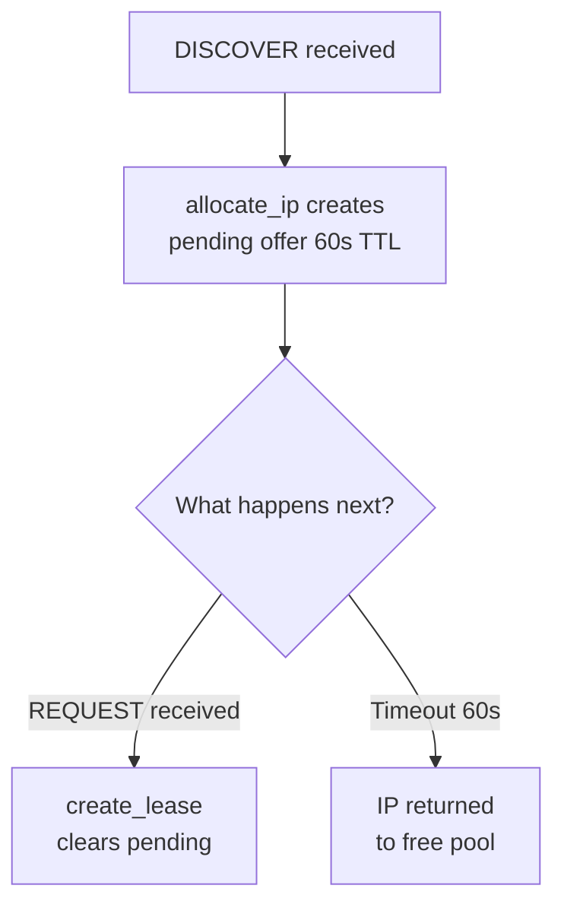

## Lease Persistence

### Write Strategy

To avoid excessive disk I/O:
1. State is marked `dirty` on any mutation
2. Saves are rate-limited to every 5 seconds minimum
3. `maybe_save()` checks both conditions before writing

```rust
async fn maybe_save(state: &mut InternalState) {
    if state.dirty && state.last_save.elapsed() >= 5 seconds {
        // Serialize and write
        state.dirty = false;
        state.last_save = Instant::now();
    }
}
```

### File Format

```json
{
  "leases": {
    "01:aa:bb:cc:dd:ee:ff": {
      "ip_address": "192.168.1.100",
      "client_id": "01:aa:bb:cc:dd:ee:ff",
      "hostname": "client-pc",
      "expires_at": "2024-01-15T12:00:00Z",
      "created_at": "2024-01-14T12:00:00Z",
      "last_seen": "2024-01-14T18:00:00Z"
    }
  },
  "ip_to_client": {
    "192.168.1.100": "01:aa:bb:cc:dd:ee:ff"
  },
  "declined_ips": {
    "192.168.1.105": "2024-01-14T10:00:00Z"
  }
}
```

### Recovery on Startup

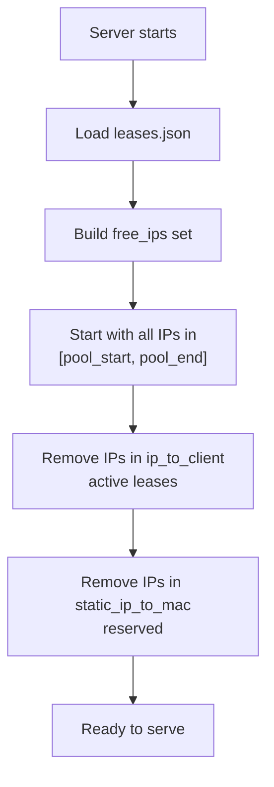

## Rate Limiting

Protects against DHCP starvation attacks and misbehaving clients.

**Configuration:**
- Window: 1 second
- Max requests: 10 per MAC per window
- Cleanup threshold: 1000 tracked MACs

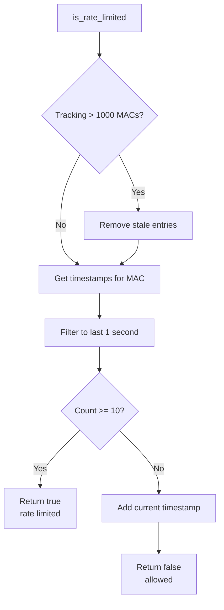

## DHCP Relay Support

When a relay agent forwards a packet, it sets `giaddr` to its own IP and may add Option 82.

### Relay Detection

```rust
if request.giaddr != Ipv4Addr::UNSPECIFIED {
    // This is a relayed packet
    // - Reply to giaddr:67 (relay agent)
    // - Echo Option 82 if present
}
```

### Option 82 Handling

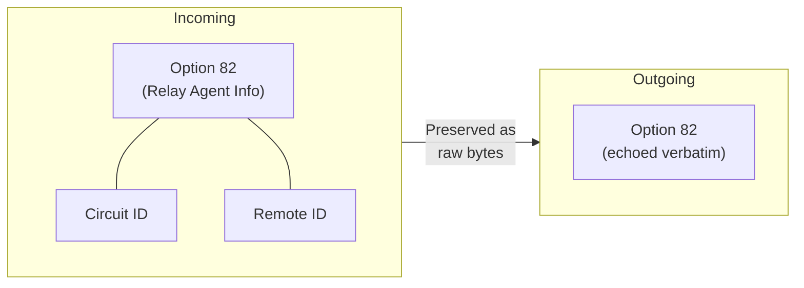

## Message Type Handlers

### DISCOVER → OFFER

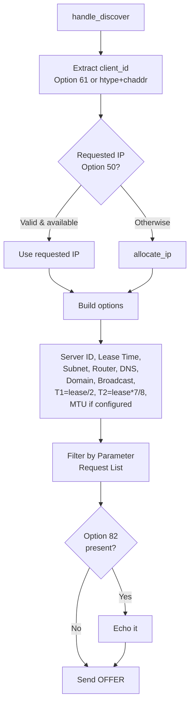

### REQUEST → ACK/NAK

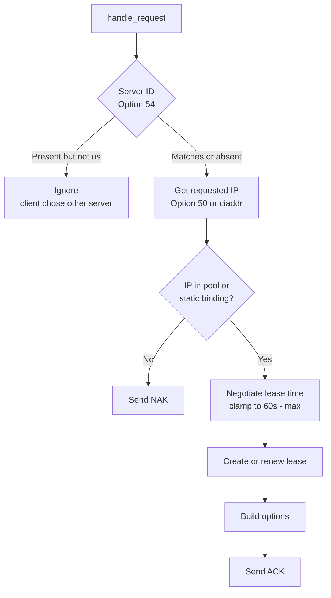

### RELEASE

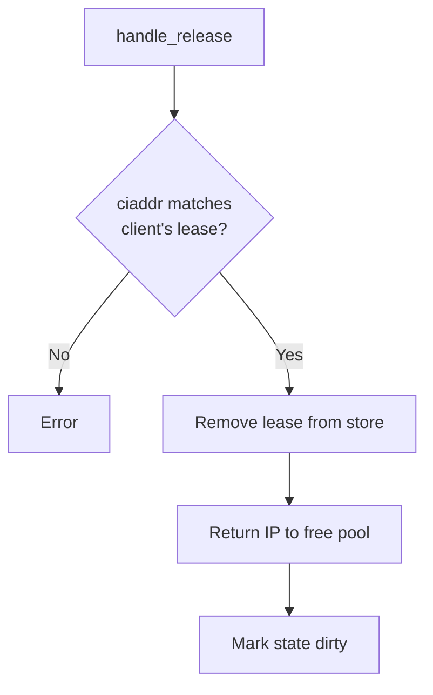

### DECLINE

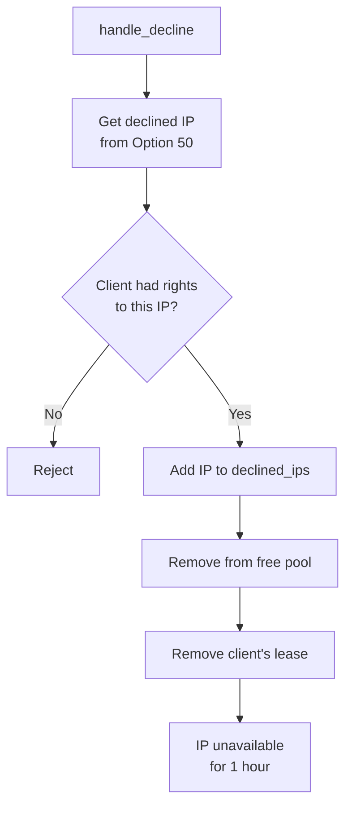

### INFORM

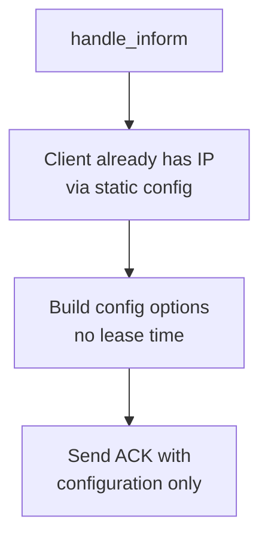

## Configuration

### Static Bindings

```json
{
  "static_bindings": [
    {
      "mac_address": "aa:bb:cc:dd:ee:ff",
      "ip_address": "192.168.1.50",
      "hostname": "printer"
    }
  ]
}
```

Static bindings:
- Always return the same IP for the MAC
- IP can be outside the dynamic pool
- Still go through DORA (client must request)
- Create normal leases (for tracking)

### Interface Binding (Windows)

```json
{
  "interface_index": 12
}
```

Uses `setsockopt(IP_UNICAST_IF)` to bind to a specific network adapter, preventing responses from going out the wrong interface on multi-homed systems.

## Error Handling

```rust
enum Error {
    InvalidPacket(String),     // Malformed DHCP packet
    InvalidConfig(String),     // Bad configuration
    PoolExhausted,             // No IPs available
    AddressOutOfRange(Ipv4Addr), // IP not in pool
    LeaseNotFound(String),     // No lease for client
    Io(std::io::Error),        // File/network I/O
    Json(serde_json::Error),   // Config/lease parsing
    Socket(String),            // Socket setup
}
```

### Error Recovery

| Error | Recovery |
|-------|----------|
| Invalid packet | Log warning, ignore packet |
| Pool exhausted | Log warning, no response (client retries) |
| I/O error on receive | Log error, continue listening |
| I/O error on send | Log warning, continue |
| Lease file corrupt | Fail startup (manual intervention needed) |

## Performance Characteristics

### Memory Usage

- ~100 bytes per active lease
- ~50 bytes per pending offer
- ~24 bytes per tracked MAC (rate limiting)
- O(pool_size) for free_ips set

### Scalability

| Operation | Complexity |
|-----------|------------|
| Packet parsing | O(options) |
| IP allocation | O(1) average, O(pool) worst case |
| Lease lookup | O(1) hash lookup |
| Lease creation | O(1) |
| File save | O(leases) |

### Bottlenecks

1. **Single file persistence**: All leases in one JSON file
2. **Save rate limiting**: 5 second minimum between writes
3. **Lock contention**: RwLock on state for all operations

For most deployments (< 10,000 clients), these are not limiting factors.
