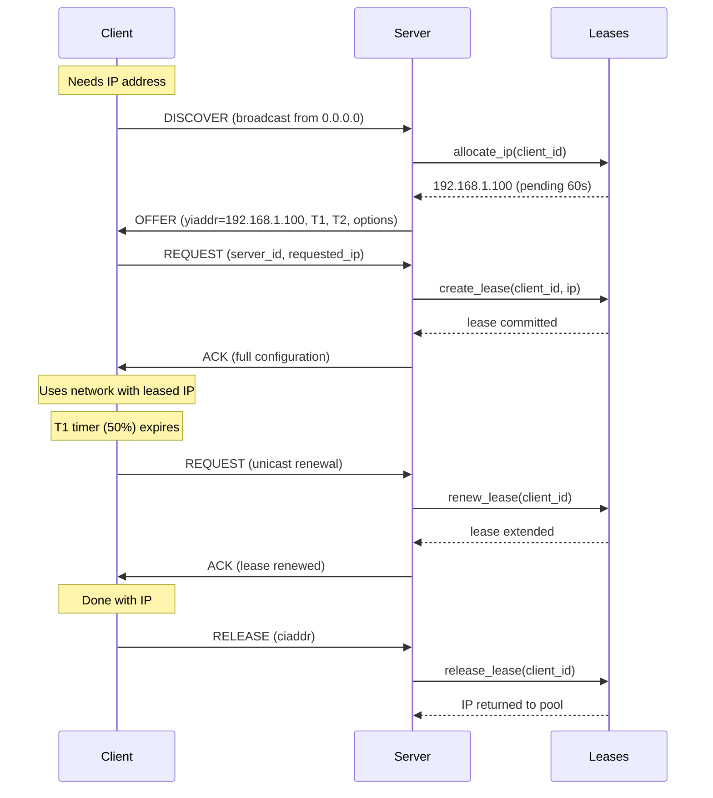
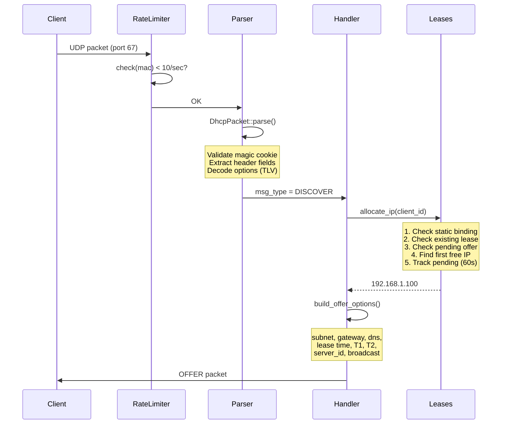
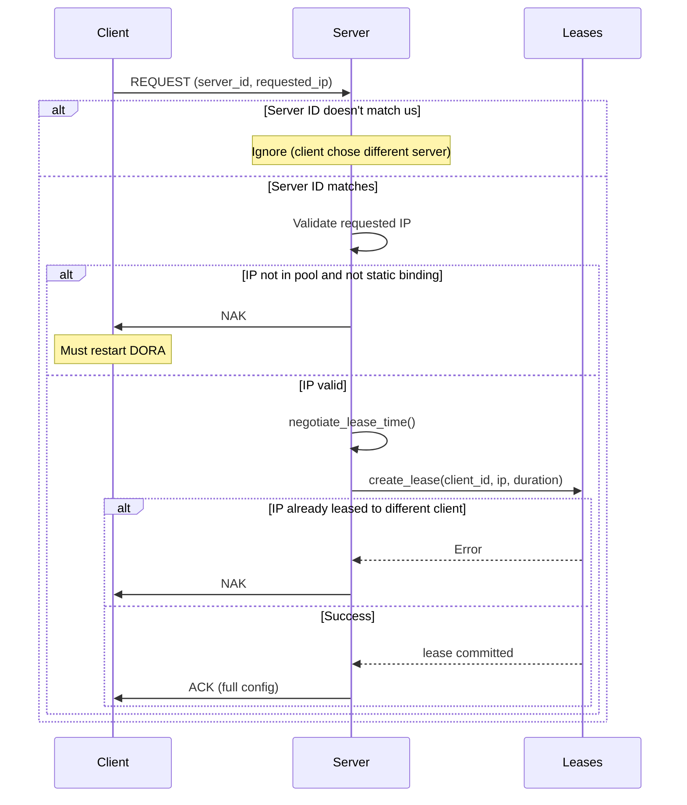
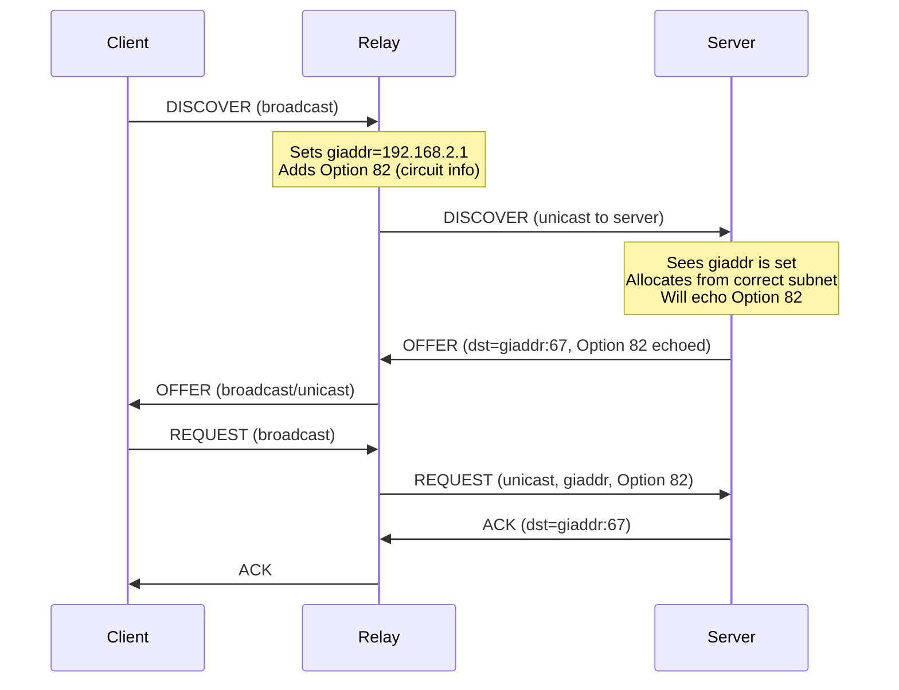
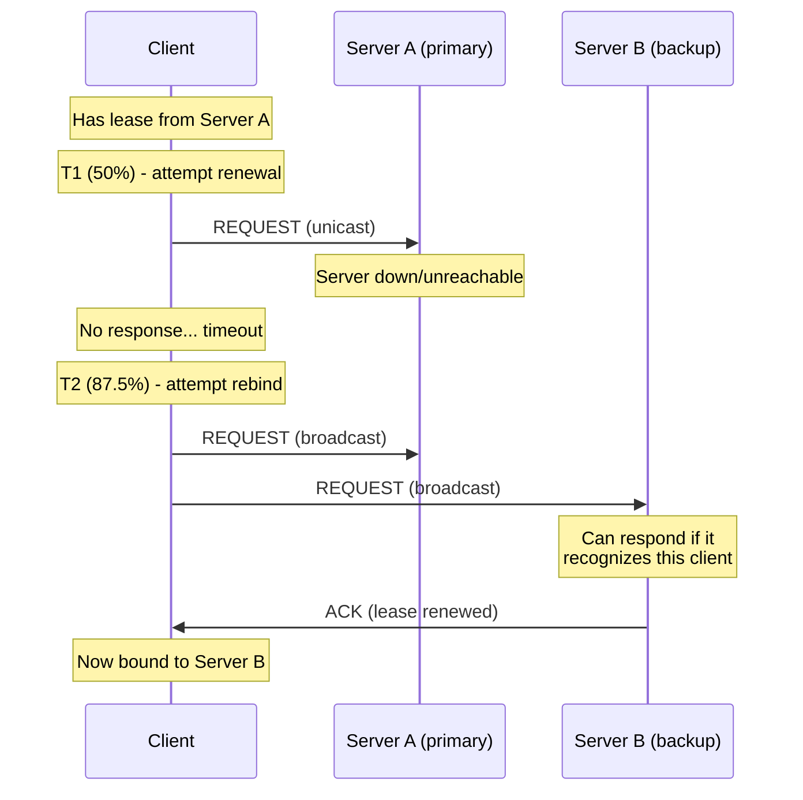
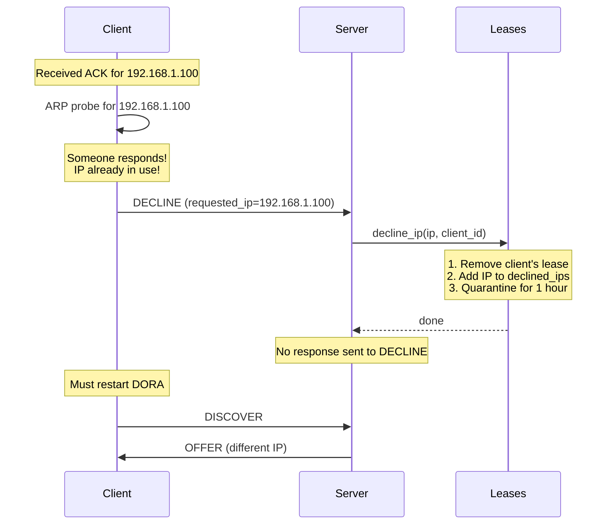
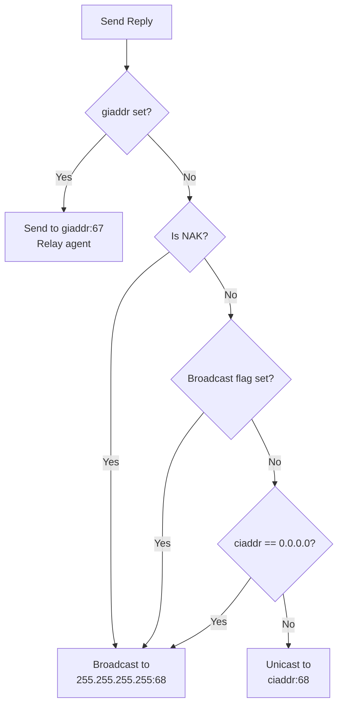
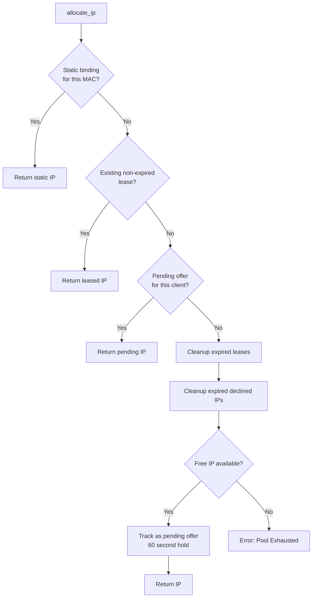

# DHCP Sequence Diagrams

## Full Lease Lifecycle

## DISCOVER → OFFER Detail

## REQUEST → ACK/NAK

## Relay Agent Flow

## T2 Rebinding (Primary Server Down)

## DECLINE (IP Conflict)

## Response Destination Logic

## IP Allocation Algorithm

